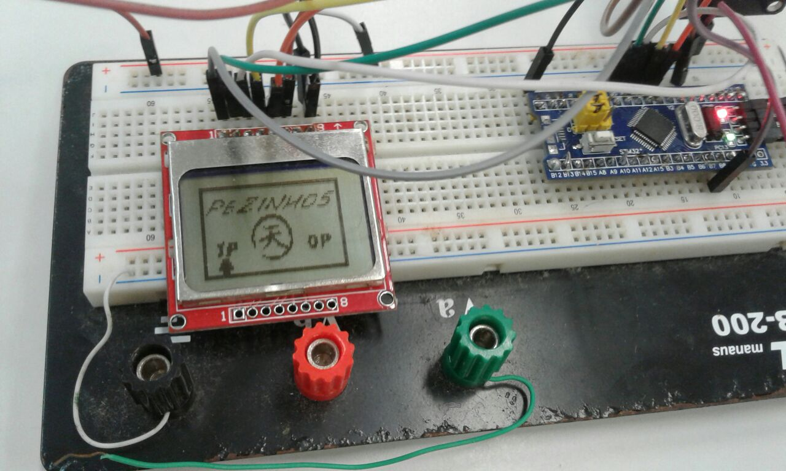
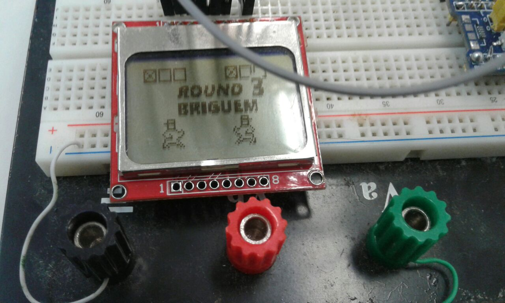
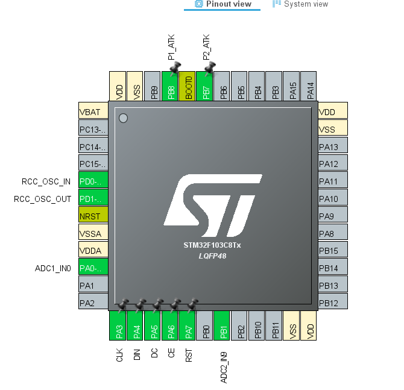

# About

This repository contains a bootleg version of the game [Footsies](https://hifight.github.io/footsies/) developed by HiFight. 

The objective of this bootleg game is to hit your opponent with a heavy kick. Tapping attack once will execute a light kick, which can stun your opponent. Pressing attack once more during the recovery of a light kick will execute the heavy kick.

Heavy kicks take very long to recover and can be blocked by holding back, leaving you vulnerable in the event it missed or was blocked by the opponent.

### Images

This game is for the STM32F103C8T6 ("Bluepill" Schematic) microcontroller using the NOKIA5110 LCD Display. It is either singleplayer or noplayers, introducing a very silly A.I. Bot fight mode.

The hardware requirements are:
- 1 STM32F103C8T6 ("Bluepill" Schematic) microcontroller 
- 1 NOKIA5110 LCD display
- 1 Analog Joystick
- 1 Pushbutton
- 5V source.

The pinout for the Bluepill board is:

### Notes

The analog joystick is powered with 5V and goes into the A0 (ADC1) pin. It may need tweaking and recompiling in the code since the joystick I used was wack and read values a bit off. Simply tweak [this function](https://github.com/lucasgcb/STM32-Footsies/blob/b2c8ca5e2d3732149facf05cf5b7d882d2eb8d70/Src/Interpreter1FSM.c#L58-L87) for the ADC levels for Right and Left, respectively.

This software was developed with  STM32CubeMX and is implemented using FreeRTOS. There are 8 state machines which control the menu, player input, player view and player state, besides the bots.

